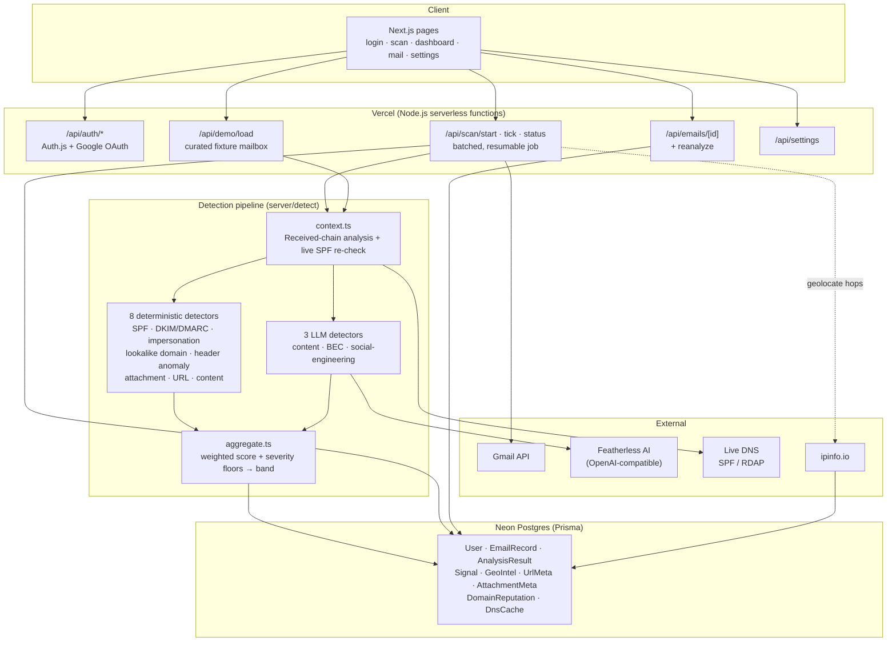

# MailSentry — SIH26106

**AI-powered email threat detection, geolocation & forensic intelligence platform.**

Connects to a user's Gmail (Google OAuth, read-only), analyzes every message for
phishing, sender spoofing / impersonation, malicious URLs & attachments, social
engineering and Business Email Compromise, assigns a **0–100 fraud/risk score**
with a human-readable explanation, and adds **geolocation + forensic
intelligence** per mail (originating IP, mail-server hop timeline,
SPF/DKIM/DMARC authenticity).

Smart India Hackathon — problem statement **SIH26106**.

## Stack

- **Next.js 16** (App Router, TypeScript, Turbopack) — deployed on **Vercel**
- **Auth.js v5** + Google OAuth (`gmail.readonly`)
- **Prisma 6** + **Neon** Postgres
- **Featherless AI** (OpenAI-compatible) for NLP / BEC / social-engineering analysis
- **ipinfo.io** for sender-IP geolocation
- `mailparser` + `mailauth` for MIME parsing and SPF/DKIM/DMARC + Received-chain

## Architecture



**Scan flow** (Vercel functions have no long-running process, so scanning is
client-orchestrated): `POST /api/scan/start` lists Gmail message IDs into a
persisted `ScanJob.messageQueue`; the `/scan` page then polls
`POST /api/scan/tick` in a loop, each call processing a batch of 5 messages
(fetch → parse → detect → persist) within a 40s soft budget, until the queue
is empty. The same `persistAnalyzedEmail()` path is shared by the Gmail
worker, the demo-mailbox loader, and re-analysis — one pipeline, three
entry points.

## Detection engine — requirement → detector map

| SIH26106 requirement | Implementation |
|---|---|
| Detect phishing emails | `content.heuristic` (regex) + `llm.content` (Featherless) — urgency/reward language, grammar, sensitive-info requests |
| Detect spoofed / impersonated senders | `auth.spf` (live DNS re-check + Received-chain origin IP) + `auth.dkim-dmarc` (provider-stamped) + `sender.impersonation` (display-name vs domain, Reply-To mismatch, freemail-claiming-exec) |
| Malicious URLs | `url.analysis` — anchor-text/href mismatch, shorteners (with SSRF-guarded redirect expansion), punycode, raw-IP hosts, RDAP domain age on the riskiest final hosts |
| Malicious attachments | `attachment.analysis` — high-risk/double extensions, macro-enabled Office docs, RTL-override filename tricks |
| Social engineering | `content.heuristic` + `llm.social` — pretexting, urgency manufacturing, authority impersonation, trust exploitation |
| Business Email Compromise | `content.heuristic` + `llm.bec` — payment diversion, fake invoice, CEO fraud, payroll change, vendor fraud, gift-card requests |
| Fraud/risk score | `aggregate.ts` — weighted contribution across all 11 detectors + severity-tier floors → 0–100 + SAFE/LOW/MEDIUM/HIGH/CRITICAL band |
| Explain why flagged | `explain.ts` — deterministic, evidence-quoting summary (no LLM needed, always available) |
| SPF via DNS | `auth-spf.ts` + `intel/dns.ts` — sender domain → cached `dns.resolveTxt` → compare against the IP from the earliest **trusted-relay** hop in the Received chain |
| Geolocation per mail | `intel/geoip.ts` (ipinfo.io) + `intel/received-chain.ts` → `GeoIntel` rows, rendered as a Leaflet map + hop timeline on `/mail/[id]` |

Lookalike-domain detection (`domain.lookalike`) is not explicitly named in the
brief but is the mechanism behind the impersonation example in the spec
(`m1crosoft-security.com`) — homoglyph skeleton folding + Damerau-Levenshtein
typosquat distance + brand-in-subdomain, checked against a 50+ brand watchlist
(global + Indian banks/telecom/government) plus a user-editable watchlist.

## Local development

Node 24 is vendored at `~/.local/node` (not on the system PATH). Prefix commands:

```bash
export PATH="$HOME/.local/node/bin:$PATH"
```

Then:

```bash
npm install
# see docs/ENV.md, then create .env.local
npm run db:push           # push schema to Neon
npm run dev                # http://localhost:3000
npm test                   # 54 unit + fixture-golden tests
```

See **[docs/ENV.md](docs/ENV.md)** for every environment variable and the
Google OAuth / Neon setup steps.

## Demo script (for judges)

No live inbox required — the app ships a curated 14-email demo mailbox.

1. Open the deployed URL → **"Try the demo mailbox"** (still a real, read-only
   Google sign-in — needs the judge's Google account added as an OAuth test
   user beforehand).
2. `/scan` loads and scores all 14 sample emails in a few seconds, then lands
   on `/dashboard` — summary tiles + risk distribution.
3. Filter by category **BEC** → open the CEO gift-card request → walk the
   signal blocks (freemail-sender-claiming-CEO, gift-card language,
   avoids-verification), the hop timeline, and the geolocation map.
4. Open the spoofed PayPal alert → the **authenticity card** shows the live
   SPF/DMARC verdicts against `paypal.com`'s real DNS records.
5. `/settings` → raise the SPF detector's weight → **Re-run analysis** → the
   spoofed emails' scores visibly increase.
6. `/mail` → domain accordion with every scanned sender grouped and badged.

A judge's own Gmail can be added as an OAuth test user and scanned live via
the primary **"Continue with Google"** button on the same login page.

## Privacy

Email bodies are truncated (32KB text / 64KB HTML) before storage; only
derived signals (domains, IPs, URL hosts) are sent to intel APIs, never full
message content. **Settings → Delete my data** permanently removes all
scanned mail and analysis without touching the Google account connection.

## Documentation

- **[docs/SIH26106-SPEC.md](docs/SIH26106-SPEC.md)** — the hackathon brief
- **[docs/ENV.md](docs/ENV.md)** — environment variables + setup steps
- **[phase.md](phase.md)** — 8-phase implementation plan with a status tracker

## Project status

All 8 phases code-complete — see the tracker in `phase.md`. Needs Neon +
Google OAuth credentials (and optionally a Featherless API key) to run live;
see `docs/ENV.md`.
